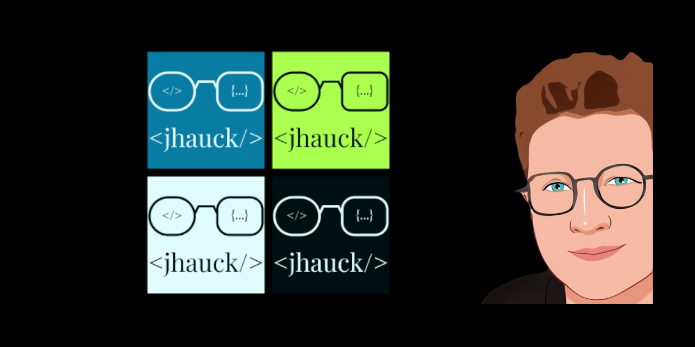

# MON ESPACE PERSONNEL : jenniferhauck.fr

Découvrez l'intersection fascinante de la technologie, du design et de l'optique. Parcourez mes projets de développement, explorez le style unique de la lunetterie, et restez informé avec des articles sur la tech et la vision.

## Table des matières
<<<<<<< HEAD

- [Technologies utilisées](#technologies-utilisées)
- [Design](#design)
- [Contact et retours](#contact-et-retours)
- [Améliorations futures](#améliorations-futures)

## Technologies utilisées

Voici les principales technologies et logiciels utilisés dans ce projet.

=======
- [Technologies utilisées](#technologies-utilisées)
- [Design](#design)
- [Contact et retours](#contact-et-retours)
- [Améliorations futures](#améliorations-futures)

## Technologies utilisées
Voici les principales technologies et logiciels utilisés dans ce projet.

>>>>>>> afa3ee5363c29a7167d0f67de888bd1a03aa20a3
- Framework: **Pas de Framework**
- Langages: **HTML, SASS, JavaScript**
- Bibliothèques: **Pas de bibliothèques**
- Autres: **GIMP, Figma, VS Code**
<<<<<<< HEAD

## Design

Voici les informations sur le design de ce site, y compris la palette de couleurs, la typographie et d'autres éléments visuels qui définissent l'esthétique de mon site.

### Palette de couleurs
=======
>>>>>>> afa3ee5363c29a7167d0f67de888bd1a03aa20a3

## Design
Voici les informations sur le design de ce site, y compris la palette de couleurs, la typographie et d'autres éléments visuels qui définissent l'esthétique de mon site.

### Palette de couleurs
| Color      | Hex                                                              |
| ---------- | ---------------------------------------------------------------- |
| Primaire   |  #097ca3 |
| Secondaire |  #abff4f |
| White      |  #e0fbfc |
| Grey       |  #c2dfe3 |
| Black      |  #001011 |

### Typographie
<<<<<<< HEAD

=======
>>>>>>> afa3ee5363c29a7167d0f67de888bd1a03aa20a3
- **Titres :** BubblegumSans
- **Corps du texte :** OpenSans

### Elements visuels

## Contact et retours
<<<<<<< HEAD

Pour toute question, suggestion ou simplement pour échanger sur le passionnant croisement de la tech et de l'optique, n'hésitez pas à me contacter. Vos retours sont les bienvenus pour améliorer continuellement cette expérience visuelle et informative.

=======
Pour toute question, suggestion ou simplement pour échanger sur le passionnant croisement de la tech et de l'optique, n'hésitez pas à me contacter. Vos retours sont les bienvenus pour améliorer continuellement cette expérience visuelle et informative.
>>>>>>> afa3ee5363c29a7167d0f67de888bd1a03aa20a3
- **Email :** [jenniferhauck2017@gmail.com](mailto:jenniferhauck2017@gmail.com)
- **Facebook :** [Jennifer Hauck](https://www.facebook.com/jhauckpadowicz)
- **Instagram :** [Jennifer Hauck](https://www.instagram.com/jhauckpadowicz/)
- **Linkedin :** [Jennifer Hauck](https://www.linkedin.com/in/jennifer-hauck-b125252a2/)

<<<<<<< HEAD
## Améliorations futures

-
-
-
=======
## Améliorations futures  

- 
- 
- 

>>>>>>> afa3ee5363c29a7167d0f67de888bd1a03aa20a3
